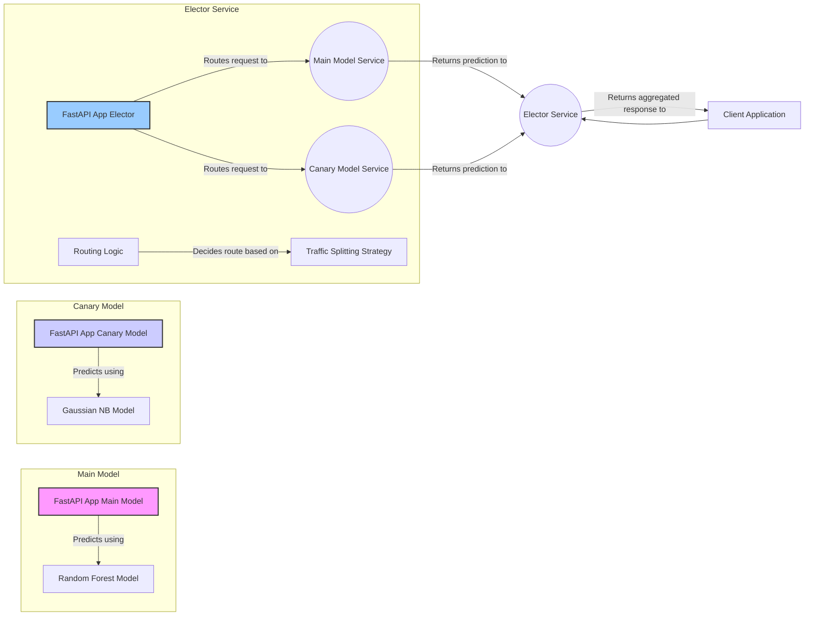

# ML Model Deployment Project

This repository contains code and configuration for deploying machine learning models on Kubernetes using FastAPI, Docker, Docker Compose, MiniKube and GCP.

## Architecture diagram


## Project Overview

This project implements a three-component ML system:

1. **Main Model**: The primary ML model service (Iris classifier)
2. **Canary Model**: A secondary model service for A/B testing
3. **Elector Service**: A routing service that directs traffic between models

The architecture allows for safe deployments through canary releases, where a small percentage of traffic is routed to a new model version before full rollout.

The project uses Google Cloud Artifact Registry for container image storage and distribution, with Kubernetes configurations for deployment to GKE or Minikube.

## Repository Structure

```
├── canary_model/
│   ├── app.py             # FastAPI application for canary model
│   └── Dockerfile         # Docker configuration for canary model
├── main_model/
│   ├── app.py             # FastAPI application for main model
│   └── Dockerfile         # Docker configuration for main model
├── elector/
│   ├── app.py             # FastAPI application for elector service
│   └── Dockerfile         # Docker configuration for elector
├── k8s/                   # Kubernetes configuration files
│   ├── canary-deployment.yaml
│   ├── canary-svc.yaml
│   ├── model-deployment.yaml
│   ├── model-svc.yaml
│   ├── elector-deployment.yaml
│   └── elector-svc.yaml
├── docker-compose.yml     # Docker Compose configuration
├── requirements.txt       # Python dependencies
└── README.md              # Project documentation
```
## Model Description

This project uses the Iris dataset to demonstrate ML model deployment:

1. **Main Model (Random Forest)**: The primary model for Iris classification using RandomForestClassifier with 100 estimators
2. **Canary Model (Gaussian Naive Bayes)**: An alternative model using GaussianNB for comparison and A/B testing

Both models predict the species of an iris flower based on four measurements:

- `s_l`: Sepal Length (cm)
- `s_w`: Sepal Width (cm)
- `p_l`: Petal Length (cm)
- `p_w`: Petal Width (cm)

The models output probability distributions across the three Iris species.

The Elector service intelligently routes between these models with a preference for the main model.

## Getting Started

### Prerequisites

- Google Cloud Platform account
- Google Cloud SDK
- GCP Artifact Registry API enabled
- Docker and Docker Compose
- Python 3.9+

### Setting Up GCP VM

```bash
# Set up environment variables
export PROJECT_ID=your-gcp-project-id
export LOCATION=us-central1  # Choose appropriate region
export REPOSITORY=ml-models  # Name of your Artifact Registry repository

# Create a VM instance with sufficient resources for Docker and Kubernetes
gcloud compute instances create ml-deployment-vm \
  --project=$PROJECT_ID \
  --zone=$LOCATION-a \
  --machine-type=e2-standard-4 \
  --image-family=ubuntu-2004-lts \
  --image-project=ubuntu-os-cloud \
  --boot-disk-type=pd-ssd \
  --boot-disk-size=50GB \
  --scopes=https://www.googleapis.com/auth/cloud-platform

# Add a label to the VM for organization
gcloud compute instances add-labels ml-deployment-vm \
  --project=$PROJECT_ID \
  --zone=$LOCATION-a \
  --labels=environment=development,project=ml-deployment

# Create a firewall rule to allow Minikube dashboard access (port 30000-32767 for NodePort services)
gcloud compute firewall-rules create allow-minikube-dashboard \
  --project=$PROJECT_ID \
  --direction=INGRESS \
  --priority=1000 \
  --network=default \
  --action=ALLOW \
  --rules=tcp:30000-32767 \
  --source-ranges=0.0.0.0/0 \
  --target-tags=ml-deployment-vm

# Add the network tag to the VM
gcloud compute instances add-tags ml-deployment-vm \
  --project=$PROJECT_ID \
  --zone=$LOCATION-a \
  --tags=ml-deployment-vm

# SSH into the VM
gcloud compute ssh ml-deployment-vm --project=$PROJECT_ID --zone=$LOCATION-a
```

### Installing Dependencies

```bash
# Update package index
sudo apt-get update

# Install Docker prerequisites
sudo apt-get install -y \
  apt-transport-https \
  ca-certificates \
  curl \
  gnupg \
  lsb-release

# Add Docker's official GPG key
curl -fsSL https://download.docker.com/linux/ubuntu/gpg | sudo gpg --dearmor -o /usr/share/keyrings/docker-archive-keyring.gpg

# Set up stable repository
echo \
  "deb [arch=amd64 signed-by=/usr/share/keyrings/docker-archive-keyring.gpg] https://download.docker.com/linux/ubuntu \
  $(lsb_release -cs) stable" | sudo tee /etc/apt/sources.list.d/docker.list > /dev/null

# Install Docker Engine
sudo apt-get update
sudo apt-get install -y docker-ce docker-ce-cli containerd.io

# Add current user to docker group to run without sudo
sudo usermod -aG docker $USER

# Apply the group membership without logging out and in again
newgrp docker

# Verify Docker installation
docker --version

# Install Docker compose
sudo apt-get  install docker-compose 

# Install Python and FastAPI
sudo apt-get install -y python3 python3-pip python3-venv

# Create a virtual environment
python3 -m venv ml_env
source ml_env/bin/activate

# Install FastAPI and dependencies
pip install "fastapi[standard]" pandas scikit-learn aiohttp
```

### Running Locally

1. Clone this repository and create project structure:
   ```bash
   git clone https://github.com/ulises-jimenez07/kube_micro_service_model.git
   cd kube_micro_service_model
   ```

2. Run individual services:
   ```bash
   # Run the canary model
   cd canary_model
   uvicorn app:app --host 0.0.0.0 --port 5001 --reload

   # In another terminal, run the main model
   cd ../main_model
   uvicorn app:app --host 0.0.0.0 --port 5000 --reload

   # In another terminal, run the elector
   cd ../elector
   uvicorn app:app --host 0.0.0.0 --port 5002 --reload
   ```

3. Test the API:
   ```bash
   curl -X POST "http://localhost:5001/predict" \
     -H "Content-Type: application/json" \
     -d '{"s_l":5.9,"s_w":3,"p_l":5.1,"p_w":1.8}'
   
   curl -X POST "http://localhost:5000/predict" \
     -H "Content-Type: application/json" \
     -d '{"s_l":5.9,"s_w":3,"p_l":5.1,"p_w":1.8}'
   
   curl -X POST "http://localhost:5002/predict" \
     -H "Content-Type: application/json" \
     -d '{"s_l":5.9,"s_w":3,"p_l":5.1,"p_w":1.8}'
   ```

### Running with Docker Compose

1. With the Dockerfiles for each service.

2. And the docker-compose.yml file:

3. Build and start all services:
   ```bash
   docker-compose up --build
   ```

4. Test the API:
   ```bash
   curl -X POST "http://localhost:5002/predict" \
     -H "Content-Type: application/json" \
     -d '{"s_l":5.9,"s_w":3,"p_l":5.1,"p_w":1.8}'
   ```

## Kubernetes Deployment

### Setting Up Minikube

```bash
# Install minikube
curl -LO https://storage.googleapis.com/minikube/releases/latest/minikube-linux-amd64
sudo install minikube-linux-amd64 /usr/local/bin/minikube

# Install kubectl
curl -LO "https://dl.k8s.io/release/$(curl -L -s https://dl.k8s.io/release/stable.txt)/bin/linux/amd64/kubectl"
sudo install -o root -g root -m 0755 kubectl /usr/local/bin/kubectl

# Start minikube
minikube start --driver=docker --cpus=4 --memory=8g --disk-size=20g

# Verify installation
kubectl get nodes
minikube status
```

### Deploying to Kubernetes

1. Create Kubernetes YAML files in a k8s directory as described in the guide.

2. Use local Docker images with Minikube (recommended for development):
   ```bash
   # Build the images locally
   docker build -t canary:latest -f canary_model/Dockerfile .
   docker build -t model:latest -f main_model/Dockerfile .
   docker build -t elector:latest -f elector/Dockerfile .

   # Load the images into Minikube
   minikube image load canary:latest
   minikube image load model:latest
   minikube image load elector:latest

   # Update the YAML files to use the local images
   sed -i "s|\${IMAGE_PLACEHOLDER}|canary:latest|g" k8s/canary-deployment.yaml
   sed -i "s|\${IMAGE_PLACEHOLDER}|model:latest|g" k8s/model-deployment.yaml
   sed -i "s|\${IMAGE_PLACEHOLDER}|elector:latest|g" k8s/elector-deployment.yaml
   
   # Important: When using local images in Minikube, you must set imagePullPolicy: Never
   # Add this line right after the image: line in each deployment YAML file:
   # imagePullPolicy: Never
   ```

3. Apply Kubernetes configurations:
   ```bash
   # Create the kubeflow namespace
   kubectl create namespace kubeflow

   # Apply the configurations
   kubectl apply -f k8s/canary-deployment.yaml
   kubectl apply -f k8s/canary-svc.yaml
   kubectl apply -f k8s/model-deployment.yaml
   kubectl apply -f k8s/model-svc.yaml
   kubectl apply -f k8s/elector-deployment.yaml
   kubectl apply -f k8s/elector-svc.yaml

   # Check deployments (specify the kubeflow namespace)
   kubectl get deployments -n kubeflow
   kubectl get services -n kubeflow
   kubectl get pods -n kubeflow
   ```

4. Test the deployment:
   ```bash
   # Get the NodePort for elector service (specify the kubeflow namespace)
   NODE_PORT=$(kubectl get svc elector -n kubeflow -o jsonpath='{.spec.ports[0].nodePort}')
   
   # Access the elector service
   curl -X POST "http://$(minikube ip):$NODE_PORT/predict" \
     -H "Content-Type: application/json" \
     -d '{"s_l":5.9,"s_w":3,"p_l":5.1,"p_w":1.8}'
   ```

   If you encounter connection issues, try these troubleshooting steps:

   ```bash
   # Check if pods are running correctly
   kubectl get pods -n kubeflow
   
   # Check logs for any pod (replace pod-name with actual pod name)
   kubectl logs pod-name -n kubeflow
   
   # Alternative way to access the service using minikube
   minikube service elector -n kubeflow --url
   
   # Then use the URL provided by the above command
   curl -X POST "$(minikube service elector -n kubeflow --url)/predict" \
     -H "Content-Type: application/json" \
     -d '{"s_l":5.9,"s_w":3,"p_l":5.1,"p_w":1.8}'
   
   # If needed, ensure minikube tunnel is running (in a separate terminal)
   minikube tunnel
   ```

## Deploying to Google Cloud Platform (GCP)

This section provides a step-by-step guide for deploying the ML model microservices to Google Cloud Platform (GCP) using Google Kubernetes Engine (GKE) and Artifact Registry.

### 1. Setting Up Environment Variables

Start by setting up environment variables that will be used throughout the deployment process:

```bash
# Set up environment variables
export PROJECT_ID=your-gcp-project-id
export LOCATION=us-central1  # Choose appropriate region
export REPOSITORY=ml-models  # Name of your Artifact Registry repository
export CLUSTER_NAME=ml-model-cluster  # Name for your GKE cluster
```

### 2. Creating a GKE Cluster

Create a Google Kubernetes Engine (GKE) cluster to host your microservices:

```bash
# Enable the GKE API
gcloud services enable container.googleapis.com

# Create a GKE cluster
gcloud container clusters create $CLUSTER_NAME \
  --project=$PROJECT_ID \
  --zone=$LOCATION-a \
  --machine-type=e2-standard-2 \
  --num-nodes=3 \
  --release-channel=regular

# Get credentials for kubectl to interact with the cluster
gcloud container clusters get-credentials $CLUSTER_NAME \
  --zone=$LOCATION-a \
  --project=$PROJECT_ID

# Verify the cluster is running
kubectl get nodes
```

### 3. Setting Up GCP Artifact Registry

Create an Artifact Registry repository to store your Docker images:

```bash
# Enable the Artifact Registry API
gcloud services enable artifactregistry.googleapis.com

# Create Artifact Registry repository
gcloud artifacts repositories create $REPOSITORY \
  --repository-format=docker \
  --location=$LOCATION \
  --description="ML model container images"

# Configure Docker to use Google Cloud as a credential helper
gcloud auth configure-docker $LOCATION-docker.pkg.dev
```

### 4. Building and Pushing Images to Artifact Registry

Build your Docker images and push them to the Artifact Registry:

```bash
# Build and push images
# Canary model
docker build -t $LOCATION-docker.pkg.dev/$PROJECT_ID/$REPOSITORY/canary:latest -f canary_model/Dockerfile .
docker push $LOCATION-docker.pkg.dev/$PROJECT_ID/$REPOSITORY/canary:latest

# Main model
docker build -t $LOCATION-docker.pkg.dev/$PROJECT_ID/$REPOSITORY/model:latest -f main_model/Dockerfile .
docker push $LOCATION-docker.pkg.dev/$PROJECT_ID/$REPOSITORY/model:latest

# Elector
docker build -t $LOCATION-docker.pkg.dev/$PROJECT_ID/$REPOSITORY/elector:latest -f elector/Dockerfile .
docker push $LOCATION-docker.pkg.dev/$PROJECT_ID/$REPOSITORY/elector:latest
```

### 5. Creating Kubernetes Secrets (Optional)

If your images are stored in a private Artifact Registry, you'll need to create a secret for authentication:

```bash
# Create a service account with Artifact Registry Reader permissions
gcloud iam service-accounts create artifact-registry-reader \
  --display-name="Artifact Registry Reader"

# Grant the service account permission to read from Artifact Registry
gcloud projects add-iam-policy-binding $PROJECT_ID \
  --member="serviceAccount:artifact-registry-reader@$PROJECT_ID.iam.gserviceaccount.com" \
  --role="roles/artifactregistry.reader"

# Create and download a key for the service account
gcloud iam service-accounts keys create key.json \
  --iam-account=artifact-registry-reader@$PROJECT_ID.iam.gserviceaccount.com

# Create a Kubernetes namespace for your application
kubectl create namespace kubeflow

# Create a Kubernetes secret with the service account key
kubectl create secret docker-registry gcp-artifact-registry \
  --namespace=kubeflow \
  --docker-server=$LOCATION-docker.pkg.dev \
  --docker-username=_json_key \
  --docker-password="$(cat key.json)" \
  --docker-email=your-email@example.com

# Delete the key file after creating the secret
rm key.json
```

### 6. Updating Kubernetes YAML Files

Update your Kubernetes deployment YAML files to use the images from Artifact Registry:

```bash
# Update YAML files with your Artifact Registry image paths
sed -i "s|\${IMAGE_PLACEHOLDER}|$LOCATION-docker.pkg.dev/$PROJECT_ID/$REPOSITORY/canary:latest|g" k8s/canary-deployment.yaml
sed -i "s|\${IMAGE_PLACEHOLDER}|$LOCATION-docker.pkg.dev/$PROJECT_ID/$REPOSITORY/model:latest|g" k8s/model-deployment.yaml
sed -i "s|\${IMAGE_PLACEHOLDER}|$LOCATION-docker.pkg.dev/$PROJECT_ID/$REPOSITORY/elector:latest|g" k8s/elector-deployment.yaml

# If using private images, add imagePullSecrets to your deployment files
# Add the following to the spec.template.spec section of each deployment YAML:
# imagePullSecrets:
# - name: gcp-artifact-registry
```

### 7. Deploying to GKE

Apply your Kubernetes configurations to deploy the microservices:

```bash
# Apply the configurations
kubectl apply -f k8s/canary-deployment.yaml -n kubeflow
kubectl apply -f k8s/canary-svc.yaml -n kubeflow
kubectl apply -f k8s/model-deployment.yaml -n kubeflow
kubectl apply -f k8s/model-svc.yaml -n kubeflow
kubectl apply -f k8s/elector-deployment.yaml -n kubeflow
kubectl apply -f k8s/elector-svc.yaml -n kubeflow

# Check deployments
kubectl get deployments -n kubeflow
kubectl get services -n kubeflow
kubectl get pods -n kubeflow
```

### 8. Exposing Your Services

To make your services accessible from outside the cluster:

```bash
# Create an Ingress or expose the elector service as a LoadBalancer
kubectl patch svc elector -n kubeflow -p '{"spec": {"type": "LoadBalancer"}}'

# Get the external IP address
kubectl get svc elector -n kubeflow

# Test the deployment (replace EXTERNAL_IP with the actual IP)
curl -X POST "http://EXTERNAL_IP:8000/predict" \
  -H "Content-Type: application/json" \
  -d '{"s_l":5.9,"s_w":3,"p_l":5.1,"p_w":1.8}'
```

### 9. Monitoring Your Deployment

Monitor your deployment to ensure everything is running correctly:

```bash
# Check pod status
kubectl get pods -n kubeflow

# View logs for a specific pod (replace pod-name with actual pod name)
kubectl logs pod-name -n kubeflow

# Get detailed information about a pod
kubectl describe pod pod-name -n kubeflow
```

## Monitoring and Maintenance

For production deployments, consider implementing:

1. **Monitoring**: Set up Prometheus and Grafana
2. **Logging**: Configure EFK (Elasticsearch, Fluentd, Kibana) stack
3. **CI/CD**: Implement with GitHub Actions or Cloud Build
4. **A/B Testing**: Enhance the elector service for controlled experiments
5. **Security**: Add authentication and TLS for security

## Cleanup

When finished with your deployment:

```bash
# Stop and delete Minikube cluster
minikube stop
minikube delete

# Stop GCP instance when not in use
gcloud compute instances stop ml-deployment-vm --project=$PROJECT_ID --zone=$LOCATION-a

# Delete GCP instance when project is complete
gcloud compute instances delete ml-deployment-vm --project=$PROJECT_ID --zone=$LOCATION-a
```

## Troubleshooting Common Issues

### ImagePullBackOff Error

If you see `ImagePullBackOff` errors when checking your pods:

```bash
kubectl get pods -n kubeflow
```

This usually means Kubernetes can't pull the container images. This can happen if:

1. The `${IMAGE_PLACEHOLDER}` in the YAML files wasn't replaced with actual image paths
2. The specified images don't exist in the registry
3. Minikube doesn't have access to the registry

To fix this issue, you can use Minikube's Docker daemon:

```bash
# Configure your terminal to use Minikube's Docker daemon
eval $(minikube docker-env)

# Build the images directly in Minikube's Docker daemon
docker build -t canary:latest -f canary_model/Dockerfile .
docker build -t model:latest -f main_model/Dockerfile .
docker build -t elector:latest -f elector/Dockerfile .

# Update the YAML files to use the local images
sed -i "s|\${IMAGE_PLACEHOLDER}|canary:latest|g" k8s/canary-deployment.yaml
sed -i "s|\${IMAGE_PLACEHOLDER}|model:latest|g" k8s/model-deployment.yaml
sed -i "s|\${IMAGE_PLACEHOLDER}|elector:latest|g" k8s/elector-deployment.yaml

# Update the YAML files to never pull the images
# Add the following line under the image: line in each deployment YAML:
# imagePullPolicy: Never

# Apply the configurations again
kubectl apply -f k8s/canary-deployment.yaml
kubectl apply -f k8s/canary-svc.yaml
kubectl apply -f k8s/model-deployment.yaml
kubectl apply -f k8s/model-svc.yaml
kubectl apply -f k8s/elector-deployment.yaml
kubectl apply -f k8s/elector-svc.yaml
```

## License

This project is licensed under the MIT License - see the LICENSE file for details.

